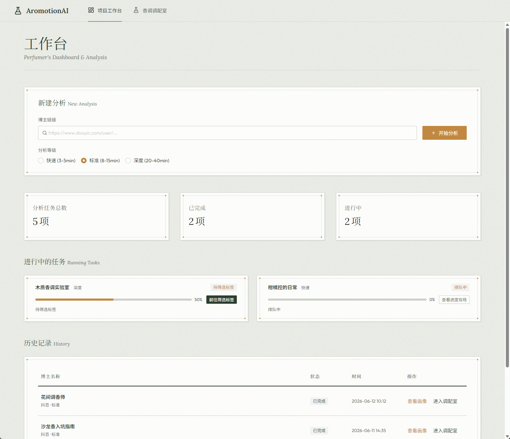
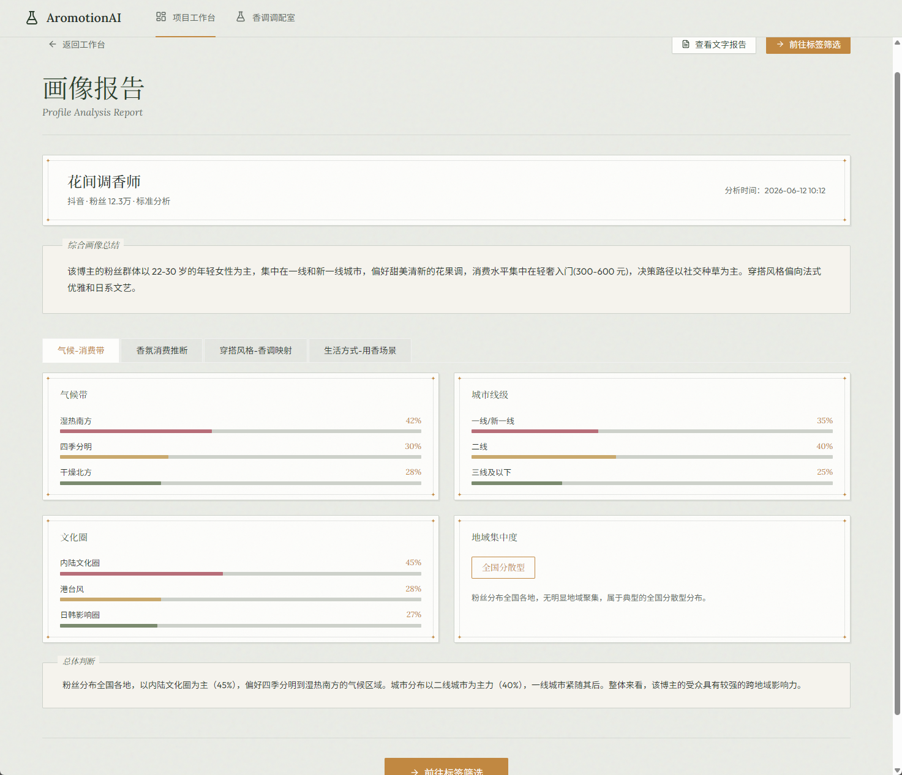
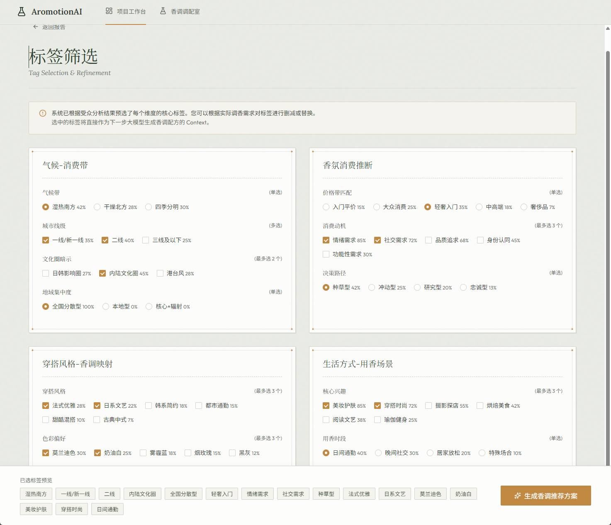
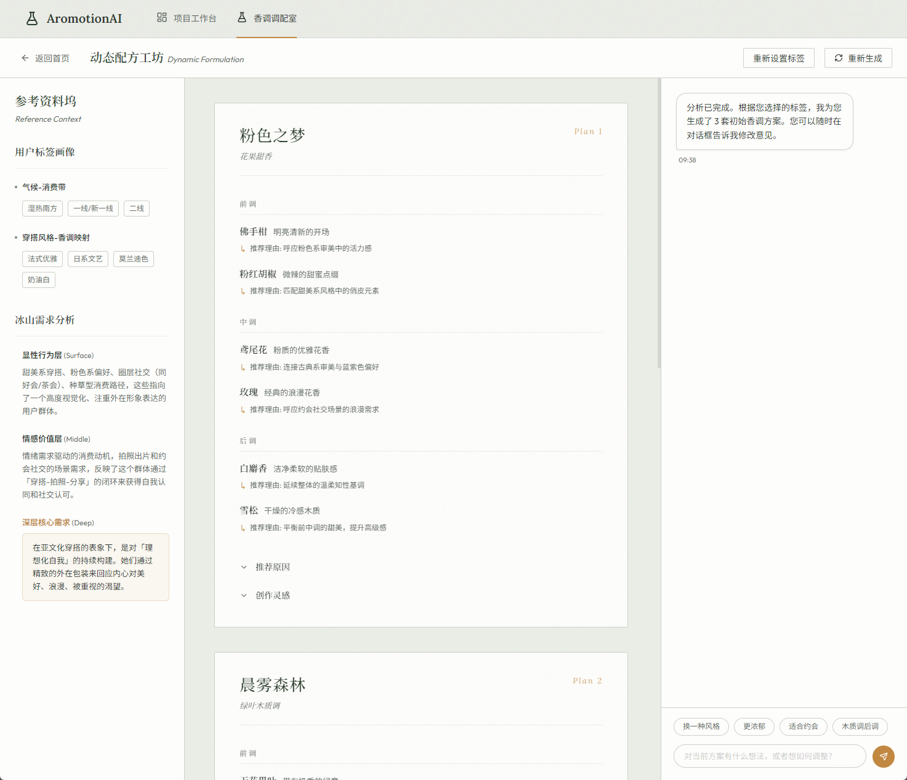

<div align="center">

# AromotionAI

**面向调香师的 AI 创香决策助手**

分析社交媒体博主及其粉丝群体画像，基于冰山理论模型预测香调方向，辅助调香师完成创香决策。


</div>

---

## 一、它解决什么问题

调香师在为一款新香水定方向时，往往要回答一个问题：**「我的目标人群究竟是怎样一群人？他们真正渴望什么？」** 传统做法靠经验、靠小范围调研，慢且主观。

**AromotionAI** 把这个问题交给数据：从一个社交媒体博主链接出发，自动完成「数据采集 → 粉丝画像分析 → 标签生成 → 香调推荐」的全链路工作，把"博主的粉丝群体是怎样一群人"翻译成"应该调出怎样一支香水"，让调香决策从经验驱动走向数据驱动。

### 冰山理论：从显性行为到潜意识需求

项目的核心方法论是**冰山理论模型**——用户标签只是水面之上的冰山一角，真正决定香调方向的是水面之下的东西。系统对粉丝群体做三层递进推理：

| 层 | 分析内容 | 示例 |
|---|---|---|
| 🧊 **显性行为**（水面之上） | 穿搭、消费、地域、社交习惯等可直接观察的特征 | "一二线城市、轻奢消费、极简穿搭" |
| 🌊 **情感价值**（水面之下） | 这些行为背后想表达什么、审美反映什么价值取向 | "通过极简穿搭表达内敛的自我掌控感" |
| ⚓ **深层需求**（冰山底部） | 最内在的心理需求：香水在他们生活中扮演什么角色 | "渴望被感知为成熟、可信、有分寸感的人" |

基于这三层推理，系统生成多套**差异化香调方案**——每套方案都带有诗意命名、前/中/后调香材、推荐理由，以及一段**创作灵感故事**，让调香师拿到的不只是一个配方，而是一个可讲述的作品。

### 核心流程

```
输入博主链接
      ↓
┌─────────────────────────────────────────┐
│  Part 1 · 用户画像分析                  │
│  数据采集 → 视觉/评论分析 → 四维度标签   │
└─────────────────────────────────────────┘
      ↓  (调香师微调标签)
┌─────────────────────────────────────────┐
│  Part 2 · 香调推荐                      │
│  冰山理论推理 → 多套香调方案 → 对话微调  │
└─────────────────────────────────────────┘
      ↓
生成结果落入历史记录
```

---

## 二、效果预览

> 截图位于 `docs/screenshots/`。

<table>
  <tr>
    <td width="50%" align="center"><b>首页 · 任务工作台</b></td>
    <td width="50%" align="center"><b>画像报告 · 四维度分析</b></td>
  </tr>
  <tr>
    <td></td>
    <td></td>
  </tr>
  <tr>
    <td align="center"><b>标签筛选</b></td>
    <td align="center"><b>调配室 · 三栏沉浸式工作台</b></td>
  </tr>
  <tr>
    <td></td>
    <td></td>
  </tr>
</table>

---

## 三、核心能力

### 📊 用户画像分析

- **四维度标签体系**：气候-消费带、香氛消费推断、穿搭-香调映射、生活方式-用香场景
- **三档预设分析等级**：快速 / 标准 / 深度，无需复杂配置即可上手
- **多维度可视化**：每个维度均以图表 + 比例 + 文字总结呈现（地域分布基于真实 IP 属地）
- **SSE 实时进度**：7 个子步骤状态全程可观测

### 🌿 香调推荐

- **冰山理论分层推理**：显性行为 → 情感价值 → 深层需求（详见上文）
- **沉浸式三栏调配室**：参考资料坞 + 配方画布 + AI 助手，避免页面跳转割裂感
- **精油萃取动画**：推理过程以可视化动画呈现，配合终端日志
- **对话式微调**：对生成方案追问、修改、重新生成，AI 会说明每次修改的原因

---

## 四、技术架构

```
┌──────────────────────────────────────────────────────────────┐
│                         浏览器（用户）                         │
└──────────────────────────────┬───────────────────────────────┘
                               │  HTTP / SSE
┌──────────────────────────────┴───────────────────────────────┐
│  Frontend · React 19 + Vite + TypeScript                      │
│  开发: Vite dev :5173     生产: nginx 静态托管 + 反代后端       │
└──────────────────────────────┬───────────────────────────────┘
                               │  /api/v1  (REST + SSE)
┌──────────────────────────────┴───────────────────────────────┐
│  Backend · FastAPI                                            │
│  ┌─────────┐  ┌───────────┐  ┌──────────┐  ┌────────────┐    │
│  │ 采集器  │→ │  分析器   │→ │ 画像聚合 │→ │  香调引擎  │    │
│  │ Douyin  │  │ 视觉+评论 │  │  四维度  │  │  冰山理论  │    │
│  └────┬────┘  └─────┬─────┘  └──────────┘  └─────┬──────┘    │
│       │             └──────────┬─────────────────┘           │
│       │                        │                             │
│  ┌────┴────────────────────────┴─────────────────────────┐   │
│  │   AI Provider Registry（GLM / OpenAI / DeepSeek）      │   │
│  │   按槽位绑定：chat / vision / fragrance                │   │
│  └───────────────────────────────────────────────────────┘   │
└──────────┬───────────────────────────────────────┬───────────┘
           │                                       │
      ┌────┴────────────┐                   ┌──────┴──────┐
      │ 抖音 API + 评论  │                   │   SQLite    │
      │ (curl_cffi +    │                   │  (持久化)   │
      │  Playwright)    │                   └─────────────┘
      └─────────────────┘
```

### 技术亮点

- **AI 模型可插拔**：通过 Provider 接口统一 GLM（`glm-5.2` 文本 / `glm-4.6v` 视觉）、OpenAI、DeepSeek，按 chat / vision / fragrance 三个槽位绑定，切换模型不改业务代码
- **平台采集器可扩展**：抽象 `PlatformCollector` 接口，抖音采集器已落地（curl_cffi 抓博主资料 / 作品列表，Playwright 抓评论含真实 IP 属地），预留小红书 / 微博
- **存储层可切换**：开发用 SQLite 零迁移开箱即用，生产可切 PostgreSQL
- **SSE 实时进度**：`TaskManager` 内存级任务编排，全程 7 个子步骤状态推送
- **前后端全链路打通**：从「输入博主链接 → SSE 进度 → 画像报告 → 标签筛选 → 香调生成 → 对话微调」全程走真实后端，经 L1–L4 端到端验证（真实抖音数据 + 真实 GLM）
- **容器化部署**：Docker Compose 两容器一键启动，nginx 反代 + SSE 透传 + 数据卷持久化

### 技术栈

| 层 | 技术 |
|---|---|
| 前端 | React 19 · Vite 8 · TypeScript 5 · Ant Design 6 · @ant-design/charts · Zustand · React Router v6 · Axios |
| 后端 | FastAPI · SQLAlchemy 2 · Pydantic 2 · curl_cffi · Playwright · ffmpeg |
| AI | GLM `glm-5.2`（文本）/ `glm-4.6v`（视觉），可插拔 Provider |
| 数据库 | SQLite（开发）/ PostgreSQL（生产），通过 SQLAlchemy 切换 |
| 实时通信 | SSE（Server-Sent Events） |
| 测试 | pytest · pytest-asyncio · httpx（**229 passed** / 11 skipped，单元 + e2e 打真实 app） |
| 部署 | Docker · Docker Compose · Nginx |
| 工具链 | uv（Python）· npm（前端） |

> 前端对接层（HTTP 信封解包 / 字段映射 / SSE 客户端 / 数据源门面）的实现细节见 [`docs/02-part1-frontend.md`](docs/02-part1-frontend.md)。

---

## 五、项目结构

```
AromotionAI/
├── backend/                    # 后端 (FastAPI + SQLAlchemy + Playwright)
│   ├── app/
│   │   ├── api/v1/             # REST + SSE 路由：cookies / analysis / fragrance
│   │   ├── platforms/douyin/   # 抖音采集器（curl_cffi 主 + Playwright 评论）
│   │   ├── analyzers/          # 视觉/评论分析 + 画像聚合 + 媒体处理（ffmpeg）
│   │   ├── engines/            # 香调推荐引擎（冰山理论 Prompt 工程）
│   │   ├── ai/                 # AI Provider（GLM/OpenAI/DeepSeek）+ 槽位绑定
│   │   ├── services/           # 业务编排（Analysis / Fragrance / Cookie / Task）
│   │   ├── core/               # TaskManager（SSE 进度）等基础设施
│   │   ├── models/  schemas/   # SQLAlchemy 模型 + Pydantic 校验
│   │   └── config.py           # Settings（读 .env）
│   ├── tests/                  # 单元测试 + e2e（打真实 app，mock 隔离外部依赖）
│   └── Dockerfile              # 后端镜像（Playwright 官方镜像 + ffmpeg）
├── frontend/                   # 前端 (React + Vite + TS)
│   └── src/
│       ├── pages/              # Dashboard / TaskProgress / ProfileReport / TagSelection / FragranceRecommend
│       ├── components/         # 公共与布局组件
│       ├── services/           # 对接层：http / api / adapters / sse / index(门面) + Mock 数据
│       ├── stores/             # Zustand 状态管理（analysis / fragrance）
│       └── types/              # TypeScript 类型定义（数据契约）
│   ├── Dockerfile              # 前端镜像（node build → nginx 托管）
│   └── nginx.conf              # 静态托管 + SPA fallback + 反代后端（含 SSE 配置）
├── docs/                       # 开发文档（唯一事实来源 SSOT）
│   ├── 00-global-dev-guide.md  # 全局架构与开发规范
│   ├── 01-part1-backend.md     # Part1 后端开发文档
│   ├── 02-part1-frontend.md    # Part1 前端开发文档
│   ├── 03-part2-backend.md     # Part2 后端开发文档
│   ├── 04-part2-frontend.md    # Part2 前端开发文档
│   └── screenshots/            # README 截图资源
├── docker-compose.yml          # 单机部署编排（backend + frontend/nginx）
├── .env.example                # 部署环境变量模板（GLM_API_KEY 等）
├── PROJECT.md                  # 架构 / 里程碑 / 接口契约
├── PROGRESS.md                 # 开发进度 + L1–L4 端到端验证记录
├── DEPLOY.md                   # 部署指南（Docker Compose）
└── README.md
```

---

## 六、快速开始（本地开发）

### 环境要求

| 工具 | 最低版本 | 说明 |
|---|---|---|
| Node.js | 18+ | 前端运行环境 |
| npm | 9+ | 随 Node 安装 |
| Python | 3.11+ | 后端运行环境 |
| [uv](https://docs.astral.sh/uv/) | latest | Python 包管理 |
| ffmpeg | — | 后端视频抽帧（缺失会降级，不强依赖） |

### 前端

```bash
git clone <repo-url> && cd AromotionAI/frontend
npm install
npm run dev       # → http://localhost:5173
```

| 命令 | 作用 |
|---|---|
| `npm run dev` | 启动 Vite 开发服务器（HMR） |
| `npm run build` | 类型检查 + 生产构建 |
| `npm run preview` | 本地预览生产构建产物 |
| `npm run lint` | ESLint 代码检查 |

### 后端

```bash
cd backend
uv sync                                  # 安装依赖
cp .env.example .env                     # 编辑 .env，填入 GLM_API_KEY（必填）
uv run playwright install chromium       # 评论采集需要的浏览器（约 294MB）
uv run uvicorn app.main:app --reload --port 8000   # → http://localhost:8000
```

- API 文档（Swagger）：http://localhost:8000/docs
- 健康检查：http://localhost:8000/health
- 启动后 SQLite 自动建表，零迁移开箱即用

### 抖音 Cookie 配置

抖音采集需要登录态。把浏览器导出的 Cookie（JSON 数组格式）放到 `backend/data/cookies/douyin.json`，采集器会自动读取。完整配置项见 [`backend/README.md`](backend/README.md)。

### 前后端联调

开发环境默认走真实后端：前端通过 `VITE_API_BASE=/api/v1`（相对路径）发请求，Vite dev server 自动转发到后端 `:8000`，同源避免 CORS。

切回纯前端预览（无需后端）：在 `frontend/.env.development` 设 `VITE_USE_MOCK=true`。

### 测试

```bash
cd backend
# 单元测试（mock 模式，不调真实 AI / 抖音 API）
AROMOTION_TEST_MODE=mock uv run pytest --ignore=tests/e2e
# 端到端测试（打真实 app，仍用 mock 隔离外部依赖）
AROMOTION_TEST_MODE=mock uv run pytest tests/e2e/
```

---

## 七、部署

单机部署：**Linux VPS + Docker Compose**，两个容器（前端 nginx + 后端 FastAPI），SQLite 持久化到宿主机卷。

```bash
git clone <repo> aromotion && cd aromotion
cp .env.example .env          # 填 GLM_API_KEY
mkdir -p data/backend/cookies # 把抖音 douyin.json 放这里
docker compose up -d --build  # 首次构建 5-15 分钟
```

访问 `http://<服务器IP>` 即可。关键设计：

- **Playwright 官方镜像**：自带 chromium + 系统依赖，规避浏览器自动化安装坑
- **nginx SSE 专项配置**：`proxy_buffering off` + 600s 超时，保证任务进度实时推送
- **数据卷**：SQLite / 媒体 / Cookie 挂载到宿主机，容器重建不丢
- **敏感凭据**：GLM_API_KEY 走宿主机 `.env`（不入库），Cookie 手动上传到挂载卷

> 完整部署步骤、运维（日志 / 重启 / 备份 / Cookie 更新）、FAQ 详见 [`DEPLOY.md`](DEPLOY.md)。

---

## 八、开发路线图

**已完成 ✅**：前端 4 核心页面、画像四维度可视化、调配室三栏工作台、抖音数据采集（curl_cffi + Playwright + ffmpeg）、AI 分析器与画像聚合、任务管理与 SSE（17 个 REST/SSE 端点）、香调推荐引擎（冰山理论 Prompt 工程）、集成测试 229 全绿、L1–L4 端到端验证、前后端全链路对接、Docker Compose 部署。

**进行中 / 规划 ⏳**：

| 内容 | 说明 |
|---|---|
| 香材 notes 结构化 | 后端 GLM 偶尔未按结构返回前/中/后调香材，需加强 prompt 或解析兜底 |
| SSE 前端流式 | provider 流式目前仅内部累积，前端实时显示生成过程需全链路透传 |
| HTTPS / 域名 | 当前 HTTP + IP，后续在 nginx 加 Let's Encrypt 或前置 Caddy |
| 运行时配置模块 | 分析等级预设 / AI 槽位绑定提升为 HTTP 接口 |
| Cookie 上传 UI | 前端管理抖音 Cookie（当前靠 `douyin.json` 文件 fallback） |
| 更多平台采集器 | 小红书 / 微博（接口已预留） |

> 里程碑详细状态见 [`PROGRESS.md`](PROGRESS.md)。

---

## 九、文档导航

| 文档 | 内容 |
|---|---|
| [DEPLOY.md](DEPLOY.md) | **部署指南**：Docker Compose 单机部署、运维、FAQ |
| [backend/README.md](backend/README.md) | 后端启动、Cookie 配置、环境变量、测试 |
| [PROGRESS.md](PROGRESS.md) | 里程碑进度 + L1–L4 端到端验证记录 |
| [PROJECT.md](PROJECT.md) | 架构、里程碑、接口契约、代码布局 |
| [docs/00-global-dev-guide.md](docs/00-global-dev-guide.md) | 全局架构、技术栈、API 规范、数据模型（SSOT） |
| [docs/01-part1-backend.md](docs/01-part1-backend.md) | Part1 后端：采集、分析、画像生成 |
| [docs/02-part1-frontend.md](docs/02-part1-frontend.md) | Part1 前端：画像报告、标签筛选、对接层细节 |
| [docs/03-part2-backend.md](docs/03-part2-backend.md) | Part2 后端：冰山模型、香调推理、对话 |
| [docs/04-part2-frontend.md](docs/04-part2-frontend.md) | Part2 前端：调配室三栏工作台 |

---

## 十、License

本项目基于 [Apache License 2.0](LICENSE) 开源。

---

<div align="center">

<sub>Built with React · Vite · TypeScript · Ant Design · FastAPI · SQLAlchemy · Playwright · GLM</sub>

</div>
